# Sprout Hollow

[](https://github.com/Ding-Ding-Projects/farming-game/actions/workflows/ci.yml)
[](https://github.com/Ding-Ding-Projects/farming-game/actions/workflows/release.yml)
[](https://github.com/Ding-Ding-Projects/farming-game/releases/latest)

A quiet, unhurried pixel-art farming game for the desktop.

You inherit one plot at the bottom of a wooded valley: a season's savings, a rusty hoe, and
ground full of weeds, rocks and fallen logs. Clear it, till it, sow it, water it, and see
what the year gives back. There is no timer pushing you and no way to lose. The whole screen
is the game.

Sprout Hollow is built with Electron, TypeScript and Vite. It renders to a single 640 x 448
canvas that is upscaled by a whole number to fit your window, so the pixels stay square and
the edges stay hard.

**Windows only.** There is no macOS or Linux build. The code has no Windows-specific
dependency and will very likely run on either, but shipping a target nobody tests is worse
than not shipping it, so only the Windows installer is published.

**[Download the latest release](https://github.com/Ding-Ding-Projects/farming-game/releases/latest)**
&nbsp;·&nbsp; [Website](https://ding-ding-projects.github.io/farming-game/)

The installer is not code-signed, so SmartScreen will warn the first time you run it. Every
release is built in public by GitHub Actions from the source in this repository, and you can
[build it yourself](#building-it-yourself) instead.


<p align="center">
  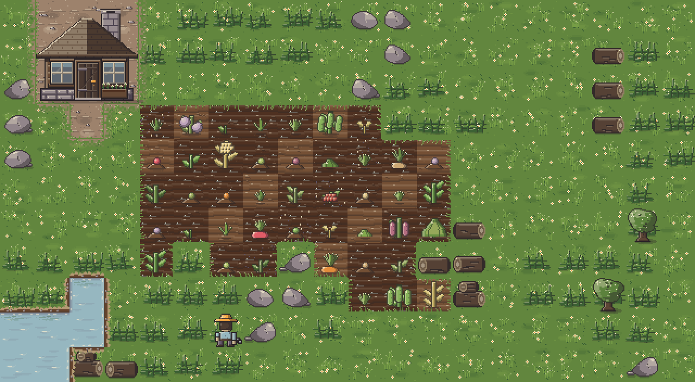
  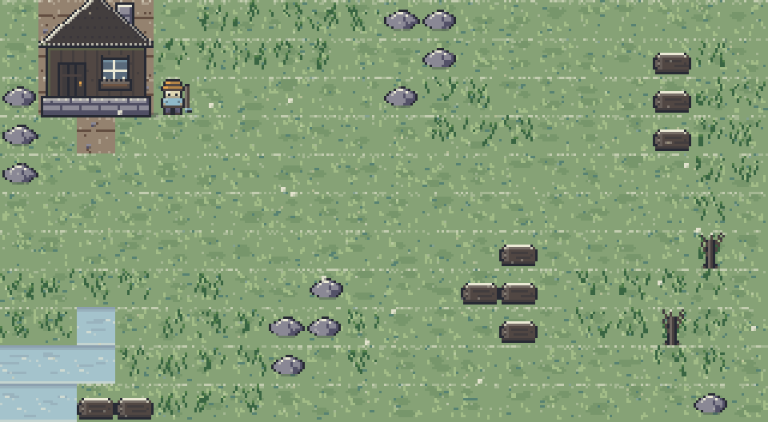
</p>

These are real frames, not mock-ups. They are produced by `tests/shots.test.ts`, which drives
the game's own art modules through a small software rasteriser and writes the PNGs directly —
see [Screenshots](#screenshots).

## Every building is a room you walk into

A coop is not a menu. Walk up to its door, press the same button you use on a crop row, and
you are inside it: a nest per bird along the wall, a feed trough, the hay, and whoever lives
there standing in their pens. Tending an animal is the same act as watering a plant — face
it, use it.

<p align="center">
  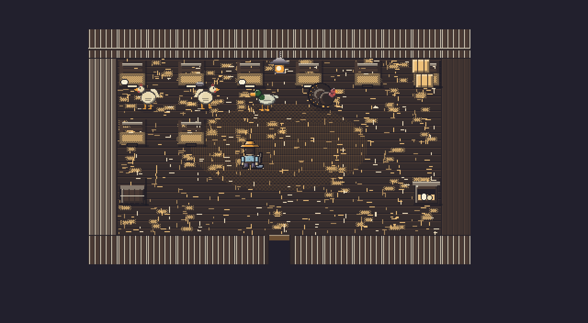
  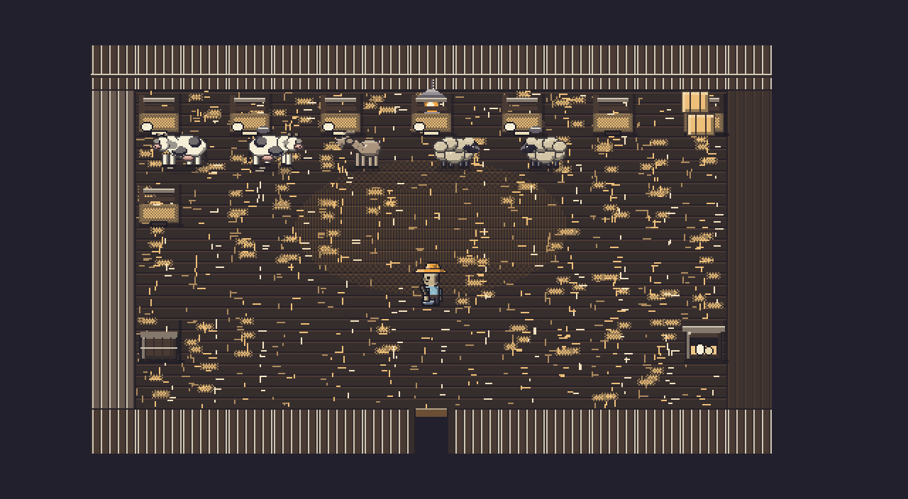
</p>

Using a pen does the most useful thing that is pending — collect what is ready, then feed,
then pet — so there is one button and never a submenu. The trough feeds the whole building
at once and the nest collects it.

<p align="center">
  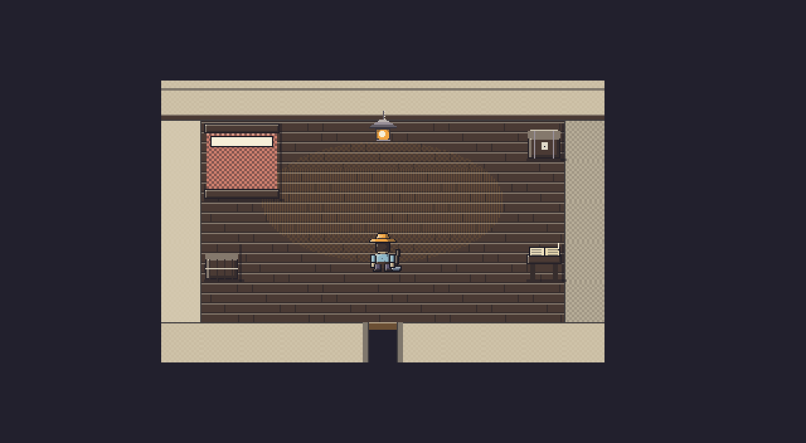
  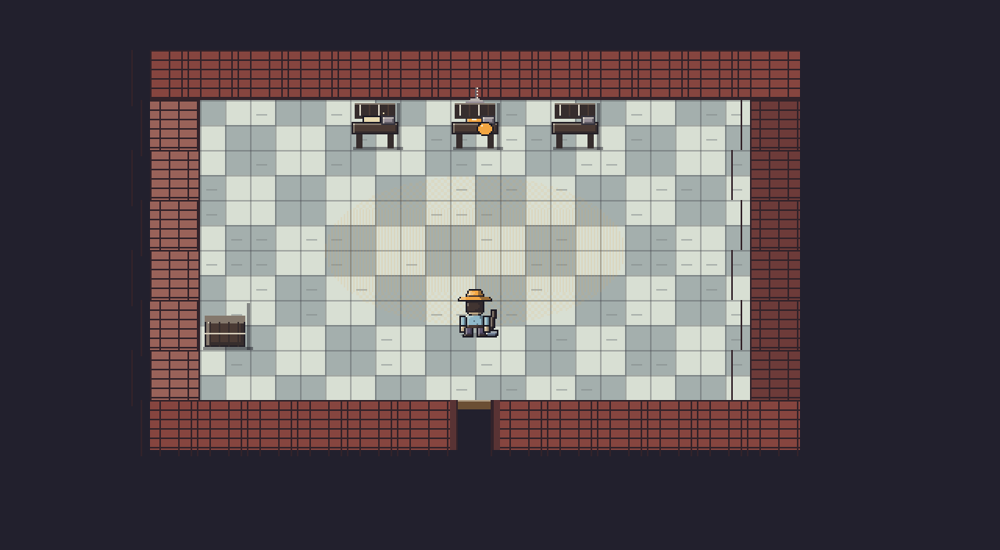
  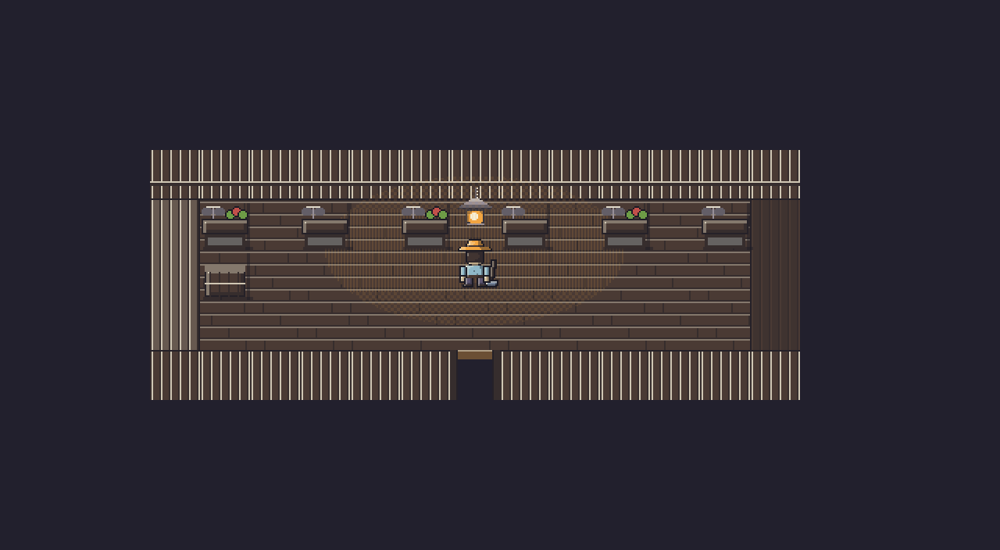
</p>

Production buildings are workrooms. The bakery carries a bench for every baking machine
standing on the farm, so a run of jobs is queued in one place instead of walked to one tile
at a time. The roadside stall gives each of its six slots a counter you walk down and price.

<p align="center">
  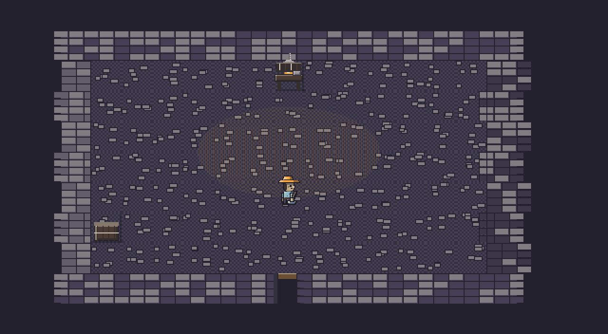
  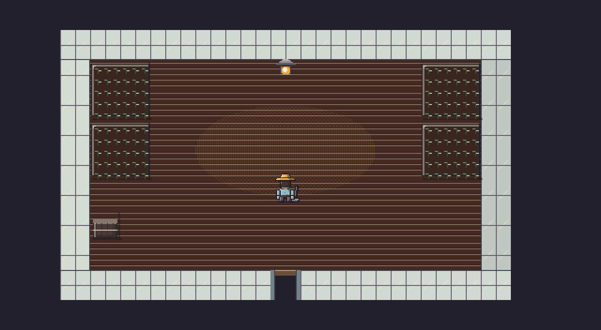
  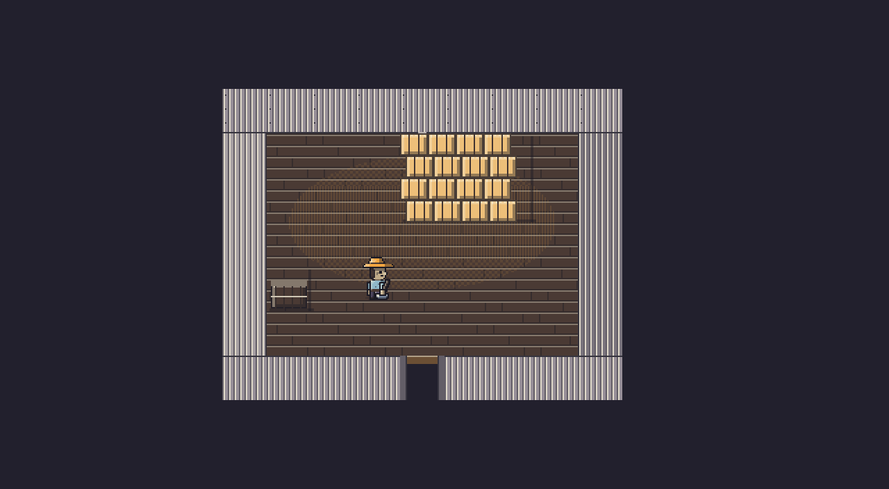
</p>

Rooms are at most twenty tiles by eleven, which is exactly the size of the farm, so going
through a door needs no camera and no second layout. The contract is
[docs/INTERIORS.md](docs/INTERIORS.md).

## Features

- Four seasons of 28 days each, a day that runs 6:00 AM to 2:00 AM, and a year that turns
  over when winter ends.
- Fifteen crops across spring, summer, fall and winter, from cheap-and-fast starters to slow
  cash crops, including several that keep bearing after the first harvest.
- Weather that matters: rain and storms water the whole farm overnight, snow waters nothing,
  and a crop left dry for three days in a row withers.
- Tools with a cost: tilling, watering, sowing, harvesting, clearing debris, placing
  sprinklers and working fertilizer into the soil all spend energy and daylight. Run out of
  either and you are carried home, lighter in the pocket.
- A shop that stocks the seeds of the current season plus sprinklers and fertilizer, sells the
  animals your buildings can house, and buys your produce at normal, silver or gold quality.
- Twenty buildings, every one of them enterable: coops and barns with a pen per animal, a
  farmhouse with a bed and an order ledger, workrooms with a bench per machine, a silo of hay,
  and a roadside stall you walk down and price slot by slot.
- Everything is deterministic: the same save always plays the same farm, because nothing in
  the rules layer reads the clock or calls the system random number generator.
- Keyboard-first controls, a screen-reader live region mirroring the game state, and support
  for the reduced-motion preference.

## Controls

| Input | Does |
|---|---|
| Arrows / WASD | Walk, and face that way |
| Space / Enter | Use what is ahead: swing the held tool, open a machine, or go through a door |
| Esc | Leave a room, or close the top panel |
| L | Inside an animal building, its occupants as a list |
| 1 - 7 | Pick hoe, can, seeds, hand, axe, sprinkler, fertilizer |
| Q / E | Cycle the selected seed |
| B | Shop |
| I | Bag |
| N | Sleep |
| H / F1 | Help |
| M | Mute |

The mouse is optional: every action is reachable from the keyboard.

## Building it yourself

You need Node.js 22 or newer.

```
npm install
```

| Command | What it does |
|---|---|
| `npm run dev` | Vite dev server, for a quick preview in the browser at the printed URL |
| `npm start` | Builds and runs the real desktop app in Electron |
| `npm test` | Runs the unit test suite (vitest) |
| `npm run typecheck` | Type-checks the renderer and the Electron main process |
| `npm run build` | Type-checks, then builds both processes into `dist/` and `dist-electron/` |
| `npm run package` | Builds and packages an installer into `release/` with electron-builder |

The browser preview plays the whole game; only the save file lives elsewhere. Under Electron,
saves are written to `save.json` in the per-user application data directory. In the browser
preview there is no such file, so a session starts fresh.

## Project layout

```
src/game/       Pure rules: calendar, crops, world generation, actions, shop, save format.
                No canvas, no DOM, no wall clock, no unseeded randomness. Fully testable.
src/engine/     Generic pixel primitives: palette, 5 x 7 bitmap font, drawing helpers,
                input, immediate-mode UI, synthesised audio. Knows nothing about farming.
src/art/        Draws game concepts as pixels: tiles, plants, the farmer, scenery, weather.
src/renderer/   Scenes, the frame loop, and the bridge to Electron.
electron/       Main process and preload script. Imports none of the above.
tests/          Unit tests for the rules layer.
docs/           The module contract every layer is written against.
DESIGN.md       The binding art direction: palette, light, motion, UI, sound.
```

The dependency arrow only ever points one way: `game` knows nothing of `engine`, `engine`
knows nothing of `art`, and `art` knows nothing of `renderer`.

## No assets, no runtime dependencies

There are no image, font or audio files anywhere in this repository, and nothing is
downloaded at runtime.

- Every sprite, tile and particle is drawn from code with rectangle and pixel calls.
- The text is a hand-authored 5 x 7 bitmap face stored as strings.
- Every sound effect is synthesised on the fly with WebAudio oscillators.
- The whole world is generated from a seed, so a farm is a number rather than a file.

The shipped application has no runtime dependencies. Everything in `package.json` is a
development dependency: TypeScript, Vite, vitest, Electron and electron-builder.

## Releases

Every push to `main` publishes a release, and the same workflow can be run manually
from the Actions tab in one click with no inputs to fill in.

Packaging is **Squirrel.Windows**, so each release carries the complete update asset
set: the `Setup.exe`, the `RELEASES` feed, the full `.nupkg` and any generated deltas.

The artifacts are **not code-signed and never will be.** Windows will show an
unknown-publisher or SmartScreen warning on first run, and that warning is accurate —
nothing here carries a signature and no authenticity is claimed. The release workflow
asserts every produced executable actually reports `NotSigned` before it will publish,
and every release lists the SHA-256 of each artifact as generated by the run that
built it.

Each release takes a code name from the public
[dim sum catalogue](https://github.com/Ding-Ding-Projects/dim-sum-photos), chosen
deterministically from the version. The photograph is linked from that catalogue and
never copied here. Run `npm run dish` to see the current one.

### Size of the tree

A convenience copy, regenerated when the tree changes; the release notes are the record,
because they are produced by the run that built the release. Reproduce it with
`npm run count`.

| Area | Files | Lines |
|---|---:|---:|
| Game rules | 27 | 16,293 |
| Engine | 6 | 1,670 |
| Art | 8 | 11,493 |
| Renderer | 14 | 6,026 |
| Application shell | 29 | 29,307 |
| Electron | 3 | 523 |
| Website | 3 | 773 |
| Tests | 34 | 13,566 |
| Scripts | 5 | 357 |
| Documentation | 12 | 2,893 |
| **Total** | **141** | **82,901** |

## Screenshots

Every image below is a real frame, rendered from the committed source by `npm run shots`.
Nothing here is a mock-up or a photograph of a window.

| | |
|---|---|
|  |  |
| **Spring, midday** | **Evening** |
|  | 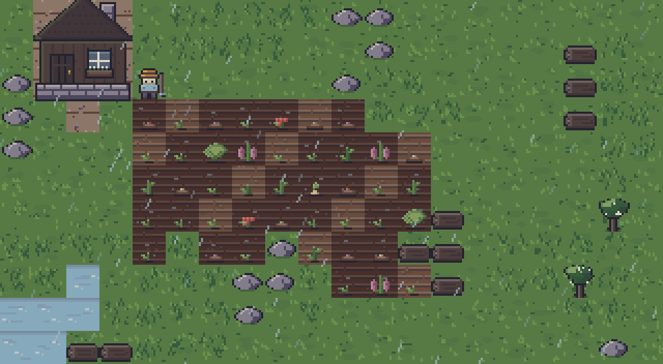 |
| **Winter** | **Rain** |
|  |  |
| **Inside the coop** | **Inside the bakery** |
| 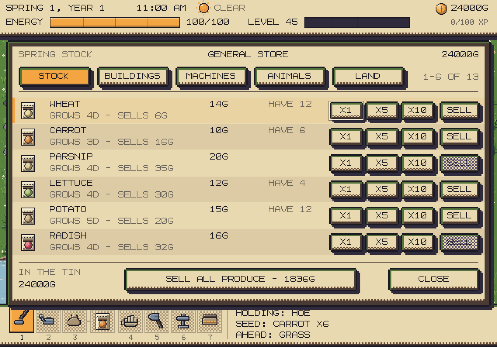 | 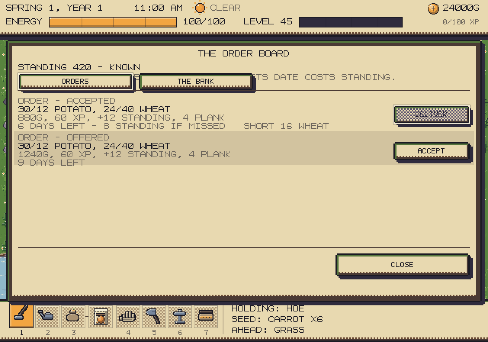 |
| **The shop** | **The order board** |

Regenerate them with:

```
npm run shots
```

<details>
<summary><strong>The capture matrix — all 33 frames, every destination the game has</strong></summary>

Every frame is produced by `npm run shots` at the committed source, and nothing in it is a
mock-up. The world and interior frames drive the real art modules; the panel frames call
the real `scene.update()` against a real save, so a panel that lays out wrongly produces a
wrong picture and a panel that throws fails the test. Each name below links to its image.

| Surface | Frames |
|---|---|
| The farm, through the day | [farm-spring-midday](docs/shots/farm-spring-midday.png), [farm-evening](docs/shots/farm-evening.png), [farm-night](docs/shots/farm-night.png) |
| Weather and seasons | [farm-rain](docs/shots/farm-rain.png), [farm-winter](docs/shots/farm-winter.png), [farm-fall-orchard](docs/shots/farm-fall-orchard.png) |
| Livestock and production | [farm-coop-and-animals](docs/shots/farm-coop-and-animals.png), [farm-machines-working](docs/shots/farm-machines-working.png) |
| Placing a building | [farm-placement-ghost](docs/shots/farm-placement-ghost.png) |
| Inside a building | [inside-coop](docs/shots/inside-coop.png), [inside-barn](docs/shots/inside-barn.png), [inside-farmhouse](docs/shots/inside-farmhouse.png), [inside-bakery](docs/shots/inside-bakery.png), [inside-stall](docs/shots/inside-stall.png), [inside-mine](docs/shots/inside-mine.png), [inside-greenhouse](docs/shots/inside-greenhouse.png), [inside-silo](docs/shots/inside-silo.png) |
| First screen | [panel-title](docs/shots/panel-title.png) |
| The shop, one per shelf | [panel-shop-stock](docs/shots/panel-shop-stock.png), [panel-shop-buildings](docs/shots/panel-shop-buildings.png), [panel-shop-machines](docs/shots/panel-shop-machines.png), [panel-shop-animals](docs/shots/panel-shop-animals.png), [panel-shop-land](docs/shots/panel-shop-land.png) |
| The bag | [panel-bag](docs/shots/panel-bag.png), [panel-bag-empty](docs/shots/panel-bag-empty.png) |
| The order board and the bank | [panel-orders](docs/shots/panel-orders.png), [panel-bank](docs/shots/panel-bank.png), [panel-orders-empty](docs/shots/panel-orders-empty.png) |
| Factory and stall | [panel-machine](docs/shots/panel-machine.png), [panel-stall](docs/shots/panel-stall.png) |
| A building's occupants | [panel-building-list](docs/shots/panel-building-list.png), [panel-inside-barn](docs/shots/panel-inside-barn.png) |
| Controls | [panel-help](docs/shots/panel-help.png) |

Empty states are captured deliberately: `panel-bag-empty` and `panel-orders-empty` are the
two places a new player lands first, and they are the easiest screens to leave broken.

**What is not here, and why.** There is no light theme, no contrast theme and no narrow
layout to capture: the game renders one fixed 640 x 448 framebuffer upscaled by whole
numbers, and `DESIGN.md` binds it to a single palette. There is also no settings surface —
the options this game has are the reduced-motion preference, which it reads from the
system, and mute. Capturing them would mean inventing screens that do not exist.

The frames come from the software rasteriser rather than from a photograph of the running
window. That is not a shortcut, it is the only route that works here: Win32 `PrintWindow`
returns solid black for any Chromium window, and on a GPU-less off-screen desktop the
renderer never reaches `dom-ready`, so an automated Electron capture hangs rather than
failing. The rasteriser drives the same modules the window does, at the same commit.

</details>

Renders real frames into `docs/shots/` and publishes the set to `site/shots/` for the
website. It is skipped by a normal `npm test`; `SHOTS=1` is what turns it on, and
`npm run shots` sets that in a way that works on Windows as well as on a POSIX shell.

The renderer is worth explaining, because the obvious approach does not work. Win32
`PrintWindow` returns solid black for any Chromium window — the page is composited on a
surface the OS cannot read back — and on a GPU-less off-screen desktop the renderer never
even reaches `dom-ready`, so an automated Electron capture hangs rather than failing.

The art layer, though, only ever makes nine 2D-context calls: `fillRect`, `fillStyle`,
`save`, `restore`, `translate`, `scale`, `beginPath`, `rect` and `clip`. So the shot renderer
implements exactly those nine, drives the **real** drawing modules against a real game state,
and rasterises the result into a PNG with nothing but `zlib`. No browser, no GPU, no
dependencies, and deterministic — the same seed always produces the same image.

It covers the world layer, the interiors and every panel. The room shots go through the very
same `drawRoom` the game calls every frame, against a real `interiorFor` derived from a real
save, so a picture of a coop that looks wrong is the coop being wrong rather than the picture.

The panels go one layer further up and run the real `scene.update()`. That turned out to need
very little: scenes read a handful of `Input` methods, the immediate-mode `UI` holds no DOM
reference at all, and the two things that would normally need a browser already fail safe —
`playSound` returns immediately when no `AudioContext` exists, and `prefersReducedMotion`
guards `matchMedia` behind a `typeof` check. A panel that sits over the farm is captured with
the farm drawn underneath, the way the scene stack really works.

It earned its keep immediately. Capturing the shop one shelf at a time produced two frames
that were byte-identical, which is how the LAND shelf was found to be unreachable from the
keyboard — the tab cycle was still modulo four after a fifth shelf was added — and the frame
after that showed the fifth tab running off the panel edge and through the row counter. Both
are fixed, and both were invisible to a test suite that only ever asked whether the code ran.

Both suites also render every frame **twice**, from freshly built scenes, and require the
bytes to match. A capture that changes between two runs of the same commit is not evidence
of anything: it makes every later review a diff full of noise, and a real regression hides
in the churn. That check found `panel-title` taking its ambient beat from wall time — it is
the one panel with no farm behind it, and the farm is what pins the beat, so its chimney
smoke and leaf fall landed on a different phase every render. The determinism claimed just
above is now enforced rather than asserted.

## License

MIT. See [LICENSE](LICENSE).
